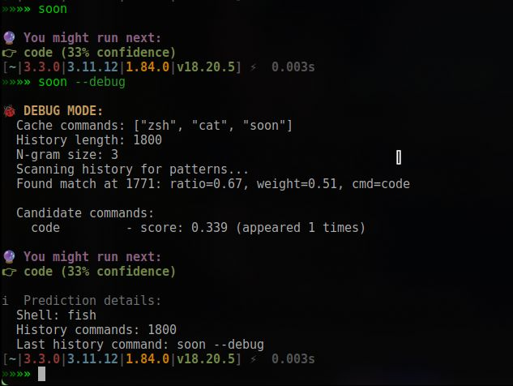

# Soon

[](https://github.com/HsiangNianian/soon/actions/workflows/publish-aur.yml)
[](https://github.com/HsiangNianian/soon/actions/workflows/publish-crates.yml)
[](https://github.com/HsiangNianian/soon/actions/workflows/publish-pypi.yml)


> 🤖 Predict your next shell command based on history — like shell autocomplete, but MORE stupid


- 🐚 Shell-aware (supports Bash, Zsh, Fish)
- 📊 Shows your most used commands and analyzes patterns
- 🧠 Smart learning from command history
- 🔄 Easy update management and version checking
- 🌍 i18n support (EN/中文) (WIP)
- 💡 Designed for clarity — **not** an autocomplete tool, but a prediction assistant.



## Install

1. Archlinux

```shell
paru -Sy soon
```

2. Cargo

```shell
cargo install soon
```

3. Python

```
pip install soon-bin
```

## Usage

```shell
»»»» soon help
Predict your next shell command based on history

Usage: soon [OPTIONS] [COMMAND]

Commands:
  now                  Show the most likely next command
  stats                Show most used commands
  learn                Train prediction and analyze command patterns
  which                Display detected current shell
  version              Show version information
  update               Check for updates and show installation options
  show-cache           Show cached main commands
  show-internal-cache  Show internal cache commands
  cache                Cache a command to soon cache (for testing)
  help                 Print this message or the help of the given subcommand(s)

Options:
      --shell <SHELL>  Override shell type (bash, zsh, fish, etc.)
      --ngram <NGRAM>  Set n-gram size for prediction accuracy [default: 3]
      --debug          Enable debug output
  -h, --help           Print help
  -V, --version        Print version
```

### Main Commands

| Command               | Description                                          |
|-----------------------|------------------------------------------------------|
| `now`                 | Show the most likely next command                    |
| `stats`               | Show most used commands                              |
| `learn`               | Train prediction and analyze command patterns       |
| `which`               | Display detected current shell                       |
| `version`             | Show version information                             |
| `update`              | Check for updates and show installation options     |
| `show-cache`          | Show cached main commands                            |
| `show-internal-cache` | Show internal cache commands                         |
| `cache <NUM>`         | Set cache size to `<NUM>` and refresh cache          |
| `help`                | Print this message or the help of subcommands        |

### Options

| Option           | Description                                         |
|------------------|-----------------------------------------------------|
| `--shell <SHELL>`| Override shell type (bash, zsh, fish, etc.)        |
| `--ngram <NGRAM>`| Set n-gram size for prediction accuracy (default: 3)|
| `--debug`        | Enable debug output                                 |
| `-h, --help`     | Print help                                          |
| `-V, --version`  | Print version                                       |

---

### Examples

#### Predict your next command (default ngram=3)
```shell
soon now
```

#### Analyze your command patterns and learn insights
```shell
soon learn
```

#### Check for updates
```shell
soon update
```

#### Show your most used commands
```shell
soon stats
```

#### Show cached main commands (default ngram=3)
```shell
soon show-cache
```

#### Show cached main commands with custom cache size (e.g., 10)
```shell
soon cache 10
soon show-cache --ngram 10
```

#### Set shell type explicitly (if auto-detect fails)
```shell
soon now --shell zsh
```

#### Enable debug output
```shell
soon now --debug
```

---

### How cache works

- The `.soon_cache` file always contains the latest N main commands (N = cache size).
- Every time you run `soon now`, `soon cache <NUM>`, or `soon show-cache`, the cache is refreshed from your shell history.
- The cache size is controlled by the `<NUM>` argument in `soon cache <NUM>` or by `--ngram <NGRAM>` option.


---

MIT © 2025-PRESENT 简律纯.
[](https://app.fossa.com/projects/git%2Bgithub.com%2FHsiangNianian%2Fsoon?ref=badge_shield&issueType=security)

[](https://app.fossa.com/projects/git%2Bgithub.com%2FHsiangNianian%2Fsoon?ref=badge_large&issueType=license)