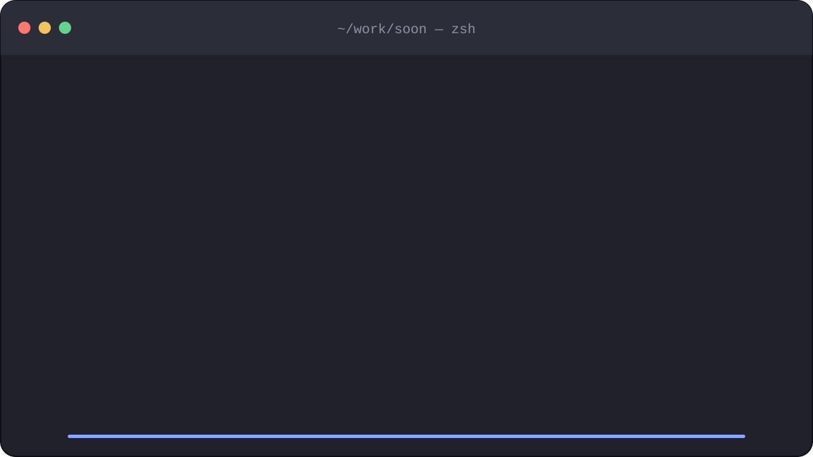

<div align="center">

# soon

**The next command, before you type it.**

A local-first terminal agent that predicts, repairs, and suggests your next full command.

[](https://crates.io/crates/soon)
[](https://pypi.org/project/soon-bin/)
[](https://github.com/HsiangNianian/soon/actions/workflows/proof-pr.yml)
[](LICENSE)

[Website](https://soon.hydroroll.team) · [v0.4.2 Zsh parser patch](https://github.com/HsiangNianian/soon/releases/tag/v0.4.2) · [Roadmap](https://github.com/users/HsiangNianian/projects/7)

</div>

> **Beta status:** v0.4.2 ships the opt-in Zsh ghost-suggestion loop, a privacy-safe adoption report, and correct handling for compound commands in Zsh history. Interactive integration is supported on native Linux and macOS; other shells and packaged platforms remain experimental unless listed in the [release contract](RELEASING.md).

<a href="https://soon.hydroroll.team">
  
</a>

## Try the beta

Install the same v0.4.2 release through Cargo or PyPI:

```bash
cargo install soon
# or: python -m pip install soon-bin
```

Enable the integration for the current Zsh session:

```zsh
eval "$(soon init zsh)"
```

At an empty prompt, soon computes in the background and renders one dim full-command suggestion. Press `Ctrl-F` to place it in the editable buffer, then review, edit, or run it yourself. Start typing to ignore it. soon never presses Enter for you.

The default prediction path uses local history, not a model or network service. It can choose a Next-step suggestion after success, a Repair suggestion after failure, or predict on demand when you run `soon`.

> **Help validate the beta:** join the [ten-user Zsh pilot](https://github.com/HsiangNianian/soon/issues/27). The study asks for privacy-safe aggregate counters and qualitative feedback, never raw command text.

## The idea

Your shell already knows what you typed. soon asks a different question: given the workflow you just followed, what complete command are you likely to run next?

The agent is a small local feedback loop:

1. Observe the completed command and its result.
2. Remember only safe, useful local context.
3. Rank complete commands from recurring transitions.
4. Render one editable ghost suggestion without blocking the prompt.
5. Learn whether it was accepted, executed, or dismissed.

## Why another shell tool?

| Tool category | You provide | It returns |
|---|---|---|
| History search, including Atuin and McFly | A query or key chord | A past command matching the search |
| Prefix autosuggestions in Fish or Zsh | The beginning of a command | A completion for that prefix |
| Prompt-driven command generation | A natural-language request | A newly generated command |
| **soon's target interaction** | **An empty prompt after a familiar workflow** | **One predicted full command, locally** |

soon is not trying to replace search or completion. The product succeeds only if accepting a correct prediction is faster than recalling and typing the command yourself.

## Keep it enabled

Add the same `eval` line to `~/.zshrc`. When no suggestion is visible, `Ctrl-F` keeps its previous behavior. To remove the hooks and restore the previous binding in the current session, run:

```zsh
soon-disable
```

The last background prediction latency is available without printing command content:

```zsh
print -r -- "$SOON_LAST_LATENCY_MS ms"
```

Cargo and PyPI are published together from one versioned tag. AUR and standalone binaries remain unsupported until they have tested artifact workflows. To install the current development branch instead:

```bash
cargo install --git https://github.com/HsiangNianian/soon
```

The supported interactive beta surface is Zsh on Linux and macOS. Other history parsers and packaged platforms remain on-demand or experimental. Maintainer guarantees are documented in [RELEASING.md](RELEASING.md).

## Use the current prototype

```bash
# Predict one full command from the detected shell history
soon

# Inspect the matching evidence
soon --debug

# Confirm which shell and history source were detected
soon which

# Show the most common executables in local history
soon stats

# Measure the current policy against past local transitions
soon replay

# Export aggregate adoption metrics that are safe to share
soon report
soon report --json
```

Override shell detection when needed:

```bash
soon --shell zsh
```

The current source can parse Bash, Zsh, Fish, Nushell, Elvish, PowerShell, and tcsh history. Parsing a format does not mean interactive integration for that shell is complete.

## What v0.4 ships

| Shipped surface | Release evidence |
|---|---|
| On-demand command plus opt-in Zsh loop | Clean-session install-to-uninstall smoke test |
| Manual, successful-command Next-step, and failed-command Repair triggers | Native Linux and macOS lifecycle regression coverage |
| Retained events plus chronological quality and latency replay | Deterministic fixture with a 20 ms Zsh p95 budget |
| Sensitive-command filters plus idempotent Zsh history import | Documented privacy behavior and aggregate-only inspection |

The implementation plan lives in [RFC #4](https://github.com/HsiangNianian/soon/issues/4). Work is tracked in the public [Personal Terminal Agent Project](https://github.com/users/HsiangNianian/projects/7).

## How the current predictor works

1. Detect the active shell and read its history file.
2. Reduce recent commands to executable names only for matching workflow context.
3. Keep each candidate as the complete historical command, including arguments.
4. Accumulate repeated transition evidence and weight newer evidence more heavily.
5. Print the highest-ranked full command without presenting the heuristic as calibrated confidence.

This baseline is deliberately simple. A more complex ranker must beat it under `soon replay` before it replaces the deterministic hot path.

## Agent roadmap

The [v0.4 Local Agent MVP](https://github.com/HsiangNianian/soon/milestone/1) combines safe command lifecycle events, explicit `soon`, Next-step after success, Repair after failure, a private history-import path, and measured local replay.

The [v0.4.1 Adoption Sprint](https://github.com/HsiangNianian/soon/milestone/3) makes that loop easy to discover, validates it with ten Zsh users, and adds a privacy-safe report before the prediction policy becomes more complex.

The [v0.5 Hybrid Prediction Engine](https://github.com/HsiangNianian/soon/milestone/2) then measures a contextual probabilistic ranker in [#16](https://github.com/HsiangNianian/soon/issues/16) before adding opt-in local-model and OpenAI-compatible candidate sources in [#17](https://github.com/HsiangNianian/soon/issues/17). Model output is never required for the default hot path.

## Privacy

`soon`, `soon now`, `soon replay`, `soon report`, `soon init zsh`, and the local learning commands read files on your machine and do not require a network service. The Zsh integration invokes the local predictor in a background process; it does not upload history or block the prompt while waiting for a result.

The current source rejects likely inline API keys, tokens, authorization headers, password flags, private-key material, and known credential prefixes before storing a command or suggestion. It applies the same filter again before ranking or rendering shell history, old event data, legacy learn data, provider context, and model output. Rejections report a category, not the command text.

Add exact case-sensitive exclusions or regular-expression exclusions without editing stored data:

```bash
soon config set privacy.excluded_literals 'company-deploy --production'
soon config set privacy.excluded_patterns '(?i)^kubectl .*--context production'
```

Comma-separated values configure more than one exclusion. Literal values are redacted from `soon config`, `config get`, and successful `config set` output. Invalid regular expressions are rejected before the configuration is saved.

`soon learn ask` is different: it is an optional experimental path that sends only filtered recent commands and the current directory to the OpenAI-compatible or Ollama endpoint you configure. It does not send event IDs, exit codes, feedback, stdout, or stderr. Model candidates pass through the same local filter before display.

Provider credentials are read at request time from an environment variable and are never stored or printed by soon. The default variable is `SOON_LLM_API_KEY`; configure a different variable name with `llm.api_key_env`. For example, this Zsh flow keeps the value out of shell history:

```zsh
soon config set llm.provider openai
soon config set llm.api_url https://api.openai.com
read -rs 'SOON_LLM_API_KEY?API key: '
print
export SOON_LLM_API_KEY
```

Ollama can run without a credential. The legacy `llm.api_key` setting is rejected.

The Zsh lifecycle integration stores local command and suggestion events in a retained JSONL log under the operating system's application-data directory. Inspect its exact path, schema version, retention, and aggregate counts without printing command text:

```bash
soon events inspect
```

The default retention is 10,000 events. It is user-controlled, and clearing requires explicit confirmation:

```bash
soon config set events.retention 5000
soon events clear --yes
```

Give a fresh profile useful event memory by previewing a Zsh history import first:

```bash
# Uses ~/.zsh_history
soon events import-zsh --preview
soon events import-zsh

# Or pass current and rotated files explicitly, oldest first
soon events import-zsh --preview \
  --path ~/.zsh_history.1 \
  --path ~/.zsh_history
soon events import-zsh \
  --path ~/.zsh_history.1 \
  --path ~/.zsh_history
```

Plain command-per-line history and Zsh extended history (`: <epoch>:<duration>;<command>`) are supported. Extended timestamps and durations are preserved; unavailable cwd, exit status, and plain-history timestamps remain unknown. Preview and import summaries report importable, sensitive, malformed, duplicate, and already-imported counts without printing command text. Stable event IDs make repeated imports idempotent, including identical rotated files.

Measure the deterministic policy against that local event memory:

```bash
soon replay
```

Replay follows JSONL append order rather than event timestamps. For each linked command transition it predicts first, scores the result, and only then exposes that transition to later samples, so future observations cannot leak into training. Unknown exit status is classified as `manual`; exit status zero is `next-step`; any other status is `repair`.

`Samples` counts eligible linked transitions. Coverage is predictions divided by samples, and top-1 match is exact command matches divided by all samples. Overall and per-trigger rows include p50/p95 prediction latency. Candidate-source rows compare deterministic history with contextual policy, local model, or remote-provider suggestions when those sources have recorded a `shown` event before the actual next command. Model attempts aligned to a later command also report timeout, invalid-output, and deterministic-fallback rates.

The report is aggregate-only: it prints no command text and performs no upload. The deterministic CI fixture has a Zsh hot-path p95 budget of **20 ms**; `soon replay` prints `PASS` or `FAIL` against that budget on the current local event set.

Export the smaller adoption report when sharing beta feedback:

```bash
soon report
soon report --json
```

This is an explicit, offline read of the same local event store. Both forms contain aggregate counters and latency distributions only—never raw commands, arguments, paths, hostnames, usernames, event IDs, timestamps, or database rows. The human form is designed for an issue or discussion; `--json` is suitable for scripts and uses schema version `2`:

| JSON field | Meaning |
|---|---|
| `schema_version` | Report schema version; currently `2` |
| `samples.eligible_transitions` | Linked command transitions eligible for chronological replay |
| `samples.predictions` | Eligible transitions for which the deterministic replay produced a prediction |
| `samples.prediction_coverage_percent` | `predictions / eligible_transitions * 100` |
| `suggestions.shown` | Retained suggestion events with the `shown` outcome |
| `suggestions.accepted` | Retained suggestion events with the `accepted` outcome |
| `suggestions.acceptance_percent` | `accepted / shown * 100` |
| `suggestions.executed` | Retained suggestion events with the `executed` outcome |
| `suggestions.execution_percent` | `executed / shown * 100` |
| `latency_ms.replay.samples` | Eligible transitions benchmarked by chronological replay |
| `latency_ms.replay.p50`, `latency_ms.replay.p95` | Offline replay-computation percentiles in milliseconds |
| `latency_ms.suggestion.samples` | Valid shell-observed latency samples from `shown` events |
| `latency_ms.suggestion.p50`, `latency_ms.suggestion.p95` | Shell-observed suggestion-result percentiles in milliseconds |

A percentage is `null` when its denominator is zero. Each latency distribution has an explicit sample count and returns `null` percentiles when that count is zero. Suggestion latency counts only valid non-negative `shown` rows, so later accepted, executed, or dismissed outcomes do not duplicate one displayed suggestion. Human output prints `n/a` for unavailable distributions.

Schema version 2 replaces the version 1 `latency_ms.p50` and `latency_ms.p95` fields with `latency_ms.replay` and `latency_ms.suggestion`. Use the suggestion distribution for user-facing adoption studies and the replay distribution for policy benchmarking.

Config lives at `~/.config/soon/config.toml`:

```bash
soon config init
soon config path
soon config get general.ngram
soon config set general.ngram 5
soon config set update.channel cargo  # or pip
```

## Commands

```text
soon                    Predict the next full command
soon now                Run the same prediction explicitly
soon init zsh           Print the opt-in Zsh integration
soon stats              Show the most-used executables
soon which              Show shell and history diagnostics
soon config             View or change local configuration
soon events             Inspect, clear, or import local agent events
soon replay             Measure local prediction quality and latency
soon report             Export privacy-safe aggregate adoption metrics
soon learn              Use the experimental learning tools
soon update             Check the configured release channel
```

## Contributing

Start with [RFC #4](https://github.com/HsiangNianian/soon/issues/4), then choose an unblocked issue from the [v0.4.1 Adoption Sprint](https://github.com/HsiangNianian/soon/milestone/3). The contextual ranker and optional model sources remain sequenced behind real-user validation.

For local verification:

```bash
cargo fmt --check
cargo test --locked
cargo clippy --locked --all-targets -- -D warnings
cargo run --locked -- --help
```

## License

[MIT](LICENSE) © 2025-present [HsiangNianian](https://github.com/HsiangNianian)
